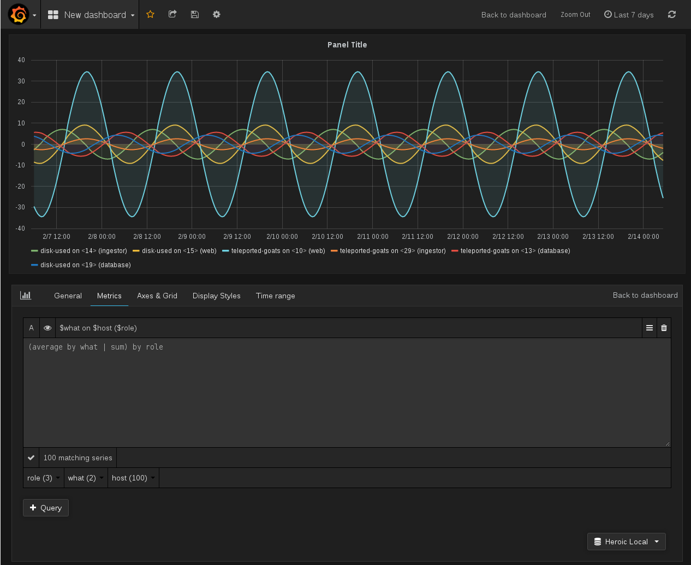

# spotify-heroic-datasource

This repository contains the Heroic datasource for
[Grafana](https://github.com/grafana/grafana).

## Development

### Releasing

You can run the following command to perform a release:

```
$> tools/release <version>
```

This will cause a release for the given version to be created.

### Setting up a local Heroic

Check out, build Heroic, and fire up the Shell:

```bash
$ git clone https://github.com/spotify/heroic ./heroic
$ cd ./heroic
$ mvn clean package -D findbugs.skip=true -D checkstyle.skip=true -D maven.test.skip=true
$ tools/heroic-shell -P memory --server
...
heroic>
```

In the shell, run the `load-generated` command. This will generate a bunch of
random data in the in-memory database:

```bash
heroic> load-generated
...
```

### Local Plugin

The following assumes that `GF_PLUGIN_DIR` points at the plugin directory of
Grafana.

```bash
$ git clone https://github.com/udoprog/spotify-heroic-datasource
$ cd ./spotify-heroic-datasource
$ npm install
$ grunt
$ ln -sf $PWD/dist $GF_PLUGIN_DIR/heroic
```

You can now run `grunt watch` to build on changes to source files.

### Usage

Now you should have a `Heroic` datasource available for configuration, point it
to `http://localhost:8080`.

You can set the title to something containing tags, like:
`$what on $host (role: $role)`

The following is an example query you can paste into the query textarea:

```
max by host
where
  role = database
  and what = teleported-goats
```

Or average by what, and then sum by role:

```
(average by what | sum) by role
```


